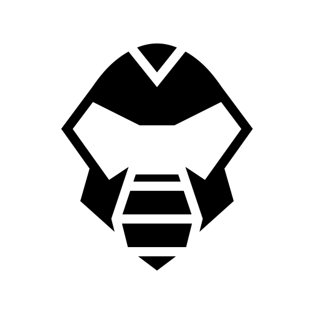

<p align="center">
  
</p>

<h1 align="center">Maximus</h1>

<p align="center">
  <strong>Self-hosted AI workspace with ChatGPT-class UX — and keys that never leave your house.</strong>
</p>

<p align="center">
  Streaming multi-provider chat · Invite-only orgs · Live admin control plane · Docker Compose · TLS by default
</p>

<p align="center">
  <a href="./docs/quickstart.md"><strong>Quickstart</strong></a> ·
  <a href="./docs/deploy.md">Deploy</a> ·
  <a href="./docs/api.md">HTTP API</a> ·
  <a href="./docs/spa-routes.md">Deep links</a> ·
  <a href="./docs/security-self-host.md">Security</a> ·
  <a href="./docs/architecture.md">Architecture</a> ·
  <a href="./docs/plan.md">Roadmap</a>
</p>

---

## Why Maximus?

Public chat products are fast — and opaque. Maximus is for operators who want the **same muscle memory** (streaming turns, branches, model picker, dark canvas) without surrendering history, models, or compliance posture to a vendor.

| | |
| --- | --- |
| **Own the data plane** | Postgres, Valkey, S3-compatible storage — all under your compose file |
| **Own the models** | Platform keys, BYOK (encrypted at rest), Ollama discovery, allowlists by role |
| **Own the surface** | Real deep links (`/c/{id}`), admin live overview, audit trail, invite-only org |
| **Ship like software** | pnpm monorepo, TypeScript, domain package with unit tests, Playwright smoke |

Built for **solo founders, security-conscious teams, and self-hosters** who want production defaults without a platform team of fifty.

> **Status:** open-source **beta** (v0.x). Excellent for private self-host. Not a multi-tenant public SaaS yet. Read [security-self-host.md](./docs/security-self-host.md) before exposing a host.

---

## Features

### Chat
- **Streaming conversations** with server-authoritative history (active branch, not client spoofing)
- **Deep links** — every thread is `/c/{conversationId}` (bookmark, share, open in new tab)
- **Model stickiness** — threads remember the model you used; picker restores on open
- **Multi-provider catalog** — OpenAI / Anthropic gated by keys; **Ollama live `/api/tags` discovery** (no phantom models)
- **Branching** — edit / regenerate with sibling navigation
- **Vision & image gen** — multimodal inputs and image generation models when capabilities allow
- **Custom instructions** — personalization stored per user and applied in the system prompt
- **Sidebar ⋮ menu** — rename, export MD/JSON, copy link, archive, delete

### Admin & ops
- **Live Overview** — health tiles (app, Postgres, Valkey, object store), connectivity, demo-mode banner, optional provider probes, SSE live updates
- **Providers** — BYOK encrypted with `ENCRYPTION_KEY`, test connection, models & pricing
- **Access** — model allowlists by role
- **Members** — invite-only onboarding with shareable invite links
- **Usage & audit** — turn aggregates and admin mutation log (no message bodies)

### Platform
- **API-first** — JSON + SSE under `/api/*`; session cookie or `Authorization: Bearer`
- **Rate limits** on Valkey (fail closed by default)
- **Security headers**, same-origin mutation guards, SSRF checks on provider URLs
- **TLS** via Caddy — HTTP-01, Cloudflare DNS, Route 53 DNS, or local CA

---

## Quick start (local)

**Prerequisites:** Node.js 22+, pnpm 9+, Docker Compose v2.

```bash
git clone https://github.com/YOUR_ORG/maximus.git && cd maximus
pnpm install
cp .env.example .env
./scripts/generate-secrets.sh --write .env

./scripts/up-dev.sh          # Postgres · Valkey · RustFS
pnpm db:migrate
pnpm dev                     # http://localhost:3000
```

1. Open **http://localhost:3000** → **Create workspace** (first user is owner).  
2. After bootstrap, the org is **invite-only**.  
3. Default `PROVIDER_MODE=fake` streams demo replies with no API keys.

For live models:

```bash
# .env
PROVIDER_MODE=live
OPENAI_API_KEY=sk-...          # optional
ANTHROPIC_API_KEY=...          # optional
OLLAMA_BASE_URL=http://127.0.0.1:11434   # lists all local tags automatically
```

Full walkthrough: **[docs/quickstart.md](./docs/quickstart.md)**  
Ops / ports / demo mode: **[docs/runbook.md](./docs/runbook.md)**

---

## Container image (GHCR)

Tagged releases push multi-label images via GitHub Actions:

```text
ghcr.io/billiondollarsolo/maximus:0.1.0
ghcr.io/billiondollarsolo/maximus:latest
```

Workflow: [`.github/workflows/release-ghcr.yml`](./.github/workflows/release-ghcr.yml) (on `v*` tags).

GHCR packages are **private by default**. For anonymous pulls, set package visibility to **Public**, or use an `imagePullSecrets` PAT (`read:packages`) — details in [docs/deploy-helm.md](./docs/deploy-helm.md#ghcr-image-pull).

## Production

```bash
cp .env.prod.example .env.prod
./scripts/generate-secrets.sh --write .env.prod
# set DOMAIN, ACME_EMAIL, TLS_MODE=http01|cloudflare|route53
./scripts/up-prod.sh
```

Open `https://YOUR_DOMAIN` → bootstrap owner → invite the team.

| TLS mode | When |
| --- | --- |
| **http01** | Public VPS, ports 80/443 open |
| **cloudflare** | DNS in Cloudflare (proxy / no open 80) |
| **route53** | DNS in AWS Route 53 |
| **local** | LAN / laptop smoke (internal CA) |

**[docs/deploy.md](./docs/deploy.md)** · **[docs/deploy-external.md](./docs/deploy-external.md)** · **[docs/deploy-helm.md](./docs/deploy-helm.md)** · **[docs/tls.md](./docs/tls.md)**

```
                    ┌─────────────┐
   Internet ──────► │    Caddy    │  TLS + HSTS + SSE
                    └──────┬──────┘
                           │
                    ┌──────▼──────┐
                    │  Maximus    │
                    │  web :3000  │
                    └──┬───┬───┬──┘
              Postgres │   │   │ RustFS (S3)
                       │   │ Valkey
```

---

## Documentation

| Doc | What you’ll get |
| --- | --- |
| [docs/quickstart.md](./docs/quickstart.md) | Local install in ~10 minutes |
| [docs/deploy.md](./docs/deploy.md) | Production Compose & env |
| [docs/deploy-external.md](./docs/deploy-external.md) | External Postgres / Valkey / S3 |
| [docs/deploy-helm.md](./docs/deploy-helm.md) | Kubernetes Helm chart |
| [SECURITY.md](./SECURITY.md) | Vulnerability reporting |
| [docs/tls.md](./docs/tls.md) | ACME modes, DNS challenges |
| [docs/runbook.md](./docs/runbook.md) | Health, demo mode, probes, backup |
| [docs/api.md](./docs/api.md) | HTTP/SSE surface, auth, catalog |
| [docs/spa-routes.md](./docs/spa-routes.md) | Deep-link map for the UI |
| [docs/architecture.md](./docs/architecture.md) | Packages, API-first & deep-link rules |
| [docs/security-self-host.md](./docs/security-self-host.md) | Hardening checklist |
| [docs/plan.md](./docs/plan.md) | Product plan & work packages |
| [AGENTS.md](./AGENTS.md) | Contributor / agent conventions |

---

## Stack

| Layer | Choice |
| --- | --- |
| App | TanStack Start / Router, React 19, Tailwind |
| Data | Postgres 16, Drizzle |
| Limits | Valkey |
| Files | S3 API (RustFS in compose) |
| Proxy | Caddy 2 (optional DNS plugins) |
| Language | TypeScript monorepo (pnpm) |

```
apps/web                 # UI + /api routes
packages/domain          # Pure domain (trees, RBAC, pricing, catalog)
packages/db              # Schema, repos, chat turn
packages/auth            # Sessions, invite-only bootstrap
packages/provider-gateway
packages/rate-limit
packages/storage
docker/                  # Compose, Dockerfile, Caddyfiles
scripts/                 # secrets, up-dev, up-prod, backup
docs/                    # operator & product docs
```

---

## Development

```bash
pnpm test            # unit + integration
pnpm typecheck
pnpm lint
pnpm --filter @maximus/web build
pnpm test:e2e        # Playwright smoke (infra + seed)
```

---

## Security (summary)

- Invite-only after first bootstrap  
- BYOK secrets encrypted with `ENCRYPTION_KEY`  
- Mutation requests same-origin checked  
- Prod cookies `Secure` + `HttpOnly`  
- Non-root container; private data-plane ports  
- Provider base URLs SSRF-checked  

Read **[docs/security-self-host.md](./docs/security-self-host.md)** before putting Maximus on the public internet.

---

## Roadmap

SSO/OIDC, MFA, RAG, richer audit, org API proxy, and more — tracked in **[docs/plan.md](./docs/plan.md)**.

---

## Contributing

1. Read [AGENTS.md](./AGENTS.md)  
2. Keep packages small; **domain stays pure** (no I/O)  
3. Tests for domain, authz, crypto, SSRF, rate-limit  
4. No secrets in git  

---

## License

[MIT](./LICENSE) © 2026 mjtechguy and Maximus contributors

---

<p align="center">
  <br/>
  <em>ChatGPT muscle memory. Server-side honesty.</em>
</p>
